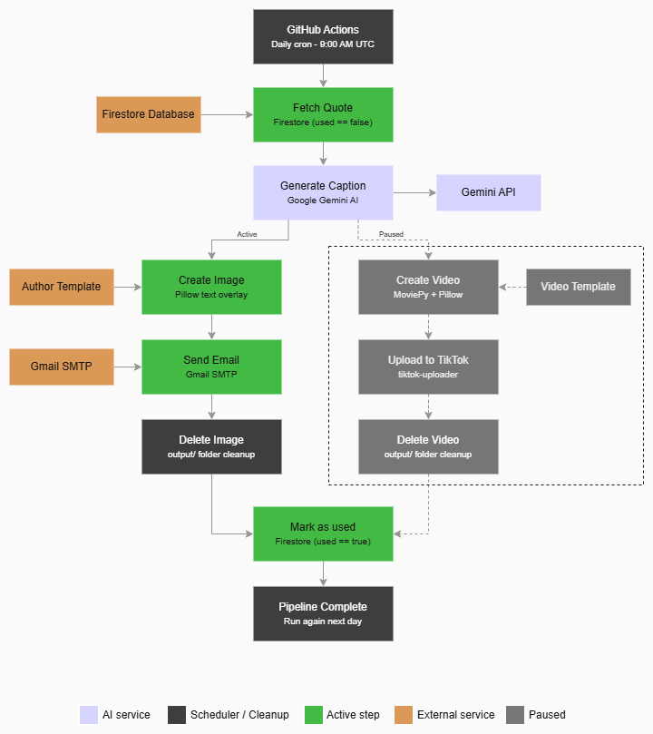

# Autopost
Automated daily pipeline that fetches literary passages from Firestore, renders them onto author-specific image templates, generates AI captions with Gemini, and delivers them via email, orchestrated by GitHub Actions.

> **TikTok posting is currently paused.** The full TikTok video pipeline (MoviePy + tiktok-uploader) is implemented and functional, but intentionally disabled. See the [TikTok Pipeline](#tiktok-pipeline-paused) section for details.

---

## How It Works
Each run executes a single, ordered pipeline:
1. **Fetch:** pulls the next unused passage from Firestore (`used == false`).
2. **Render:** draws the passage text onto an author-specific image template (`assets/images/`) using Pillow.
3. **Caption:** sends passage context to Gemini, parses a short caption and hashtags line from the response.
4. **Deliver:** sends the rendered image and caption via Gmail SMTP to your inbox.
5. **Commit:** marks the passage as used in Firestore with a posted date, only after confirmed successful delivery.
6. **Cleanup:** deletes the local image file.

Delivery success is a hard requirement before the state is updated. A failed delivery stops the pipeline early, and no passage is ever marked used unless it was actually sent.

---

## Workflow


---

## Project Structure
```
autopost/
├── .github/
│   └── workflows/
│       └── daily.yml              # GitHub Actions: runs pipeline daily
├── assets/
│   ├── images/                    # Author-specific background templates
│   │   ├── template_default.png
│   │   └── template_fyodor_dostoevsky.png
│   ├── template.mp4               # Base video template (TikTok, paused)
│   └── PALA.TTF                   # Palatino Linotype font for text overlays
├── output/                        # Temporary render output (gitignored)
├── src/
│   ├── main.py                    # Pipeline orchestrator
│   ├── firestore_client.py        # Firestore read/write
│   ├── image_client.py            # Overlay text onto author image template
│   ├── renderer.py                # Video rendering — MoviePy + Pillow (paused)
│   ├── email_client.py            # Send daily email via Gmail SMTP
│   ├── llm_client.py              # Gemini caption generation
│   ├── tiktok_client.py           # TikTok upload automation (paused)
│   ├── tiktok_upload_patched.py   # Patched tiktok-uploader (dismisses UI overlays)
│   └── seed_quotes.py             # Bulk upload passages to Firestore
├── cookies.txt.gpg                # Encrypted TikTok session (GPG)
├── .env                           # Local secrets (never committed)
├── .gitignore
└── requirements.txt
```

---

## Tech Stack
- **Data:** Google Cloud Firestore
- **Rendering:** Pillow, NumPy
- **AI Captions:** Google Gemini (`google-generativeai`)
- **Image Delivery:** Python smtplib + Gmail SMTP
- **Scheduler:** GitHub Actions (cron)
- **Social Upload:** `tiktok-uploader` (paused)
- **Config:** `python-dotenv` + GitHub Actions Secrets + GPG Encryption


## Setup

### 1. Clone and create a virtual environment

```bash
git clone https://github.com/ayoamrit/autopost
cd autopost
python -m venv venv
```

**Windows (PowerShell):**
```bash
.\venv\Scripts\Activate.ps1
```

**macOS/Linux:**
```bash
source venv/bin/activate
```

### 2. Install dependencies

```bash
pip install -r requirements.txt
```

### 3. Configure environment variables

Create a `.env` file in the project root:

```env
GOOGLE_APPLICATION_CREDENTIALS=service_account.json
GEMINI_API_KEY=your_gemini_api_key
GEMINI_MODEL=your_model_name
EMAIL_ADDRESS=your_email_address
EMAIL_APP_PASSWORD=your_email_app_password
```

### 4. Add credential files

Place these files in the project root (do not commit them):

- `service_account.json` — Google Cloud service account for Firestore access

### 5. Add author templates

Place background images in `assets/images/` following this naming convention:

```
template_firstname_lastname.png
```

Unknown authors fall back to `template_default.png`.

---

## Usage

```bash
python src/main.py
```

Each run processes exactly one passage, generates one image, and delivers one email. Firestore tracks which passages have been used, so re-running never produces duplicates.

---

## GitHub Actions Setup

The pipeline runs automatically every day at **9:00 AM UTC** via GitHub Actions.

### 1. Encrypt your cookies file (required for TikTok re-enablement)

```bash
gpg --symmetric --cipher-algo AES256 --batch --passphrase "your_passphrase" cookies.txt
git add cookies.txt.gpg
git commit -m "Add encrypted cookies"
git push origin main
```

### 2. Add GitHub Secrets

Go to **Settings → Secrets and variables → Actions** and add:

| Secret | Value |
|---|---|
| `GEMINI_API_KEY` | Your Gemini API key |
| `GEMINI_MODEL` | Your Gemini model name |
| `GOOGLE_SERVICE_ACCOUNT_JSON` | Full contents of `service_account.json` |
| `COOKIES_PASSPHRASE` | GPG passphrase used to encrypt cookies |
| `EMAIL_ADDRESS` | Your Gmail address |
| `EMAIL_APP_PASSWORD` | Your 16-character Gmail app password (no spaces) |

### 3. Trigger manually

Go to **Actions → Daily Quote Pipeline → Run workflow** to test it anytime without waiting for the schedule.

---

## Firestore Schema

Collection: `quotes`

| Field | Type | Description |
|---|---|---|
| `text` | string | The passage text |
| `author` | string | Author name |
| `book` | string | Book title |
| `used` | boolean | Whether it has been posted |
| `date_posted` | string | Date it was posted (empty if unused) |

---

## Adding More Passages

Open `src/seed_quotes.py`, add entries to the `quotes` list, and run:

```bash
python src/seed_quotes.py
```

---

## TikTok Pipeline (Paused)

The full TikTok video pipeline is implemented but currently disabled. It includes:

- **`renderer.py`** — overlays passage text onto a blank video template using MoviePy and Pillow
- **`tiktok_client.py`** — uploads the generated MP4 to TikTok using `tiktok-uploader`
- **`tiktok_upload_patched.py`** — a patched version of the uploader that automatically dismisses TikTok's UI overlays

To re-enable TikTok posting:

1. Uncomment the TikTok import and pipeline block in `src/main.py`
2. Uncomment the TikTok step in `.github/workflows/daily.yml`
3. Refresh your TikTok session cookies:
   ```bash
   tiktok-uploader -v output/quote_video.mp4 -c cookies.txt --attach
   ```
4. Re-encrypt and commit the cookies file:
   ```bash
   gpg --symmetric --cipher-algo AES256 --batch --passphrase "your_passphrase" cookies.txt
   git add cookies.txt.gpg
   git commit -m "Refresh TikTok cookies"
   ```

---

## Notes

- `cookies.txt` expires periodically — refresh it using the tiktok-uploader command above when re-enabling TikTok
- All secrets are stored either in `.env` (local) or GitHub Secrets (CI) — never hardcoded

---

## Engineering Notes

### The UI Ghost Problem

During deployment, a significant automation bottleneck was discovered: TikTok's Creator Center intermittently injects asynchronous "Feature Announcement" modals immediately after a video payload is dropped into the uploader. These modals create a transparent but impermeable DOM layer over the description field and the Post button, causing Playwright selectors to fail or hang with `TimeoutError`.

**Solution: Asynchronous UI Interception**

A zero-footprint hotfix was integrated directly into the `tiktok_uploader/upload.py` lifecycle. It acts as a UI janitor, proactively detecting and dismissing blocking overlays before the upload logic proceeds:

```python
# TIKTOK UI HOTFIX: ASYNCHRONOUS MODAL DISMISSAL
# TikTok intermittently triggers 'New Feature' overlays post-upload
# which block interaction with the 'Description' and 'Post' selectors.

try:
    logger.debug("Probing for 'New editing features' overlay...")

    # 5000ms timeout accounts for asynchronous JS rendering
    page.get_by_text("Got it").click(timeout=5000)

    logger.info("UI Hotfix: Blocking modal successfully dismissed.")

    # 1s buffer allows DOM to settle before proceeding
    page.wait_for_timeout(1000)

except Exception:
    # Fail-safe: modal not present, pipeline continues without interruption
    logger.debug("UI Hotfix: No blocking elements detected. Proceeding...")
```

If the modal is absent, the exception is swallowed silently, and the pipeline continues with zero delay.

---
